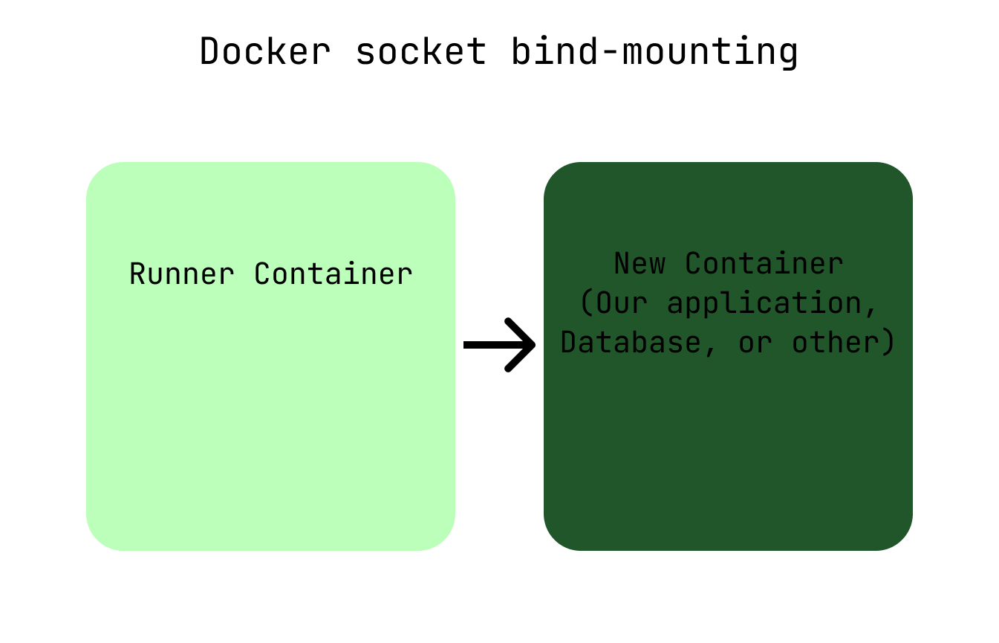

import FigCaption from '../../../components/FigCaption.astro';

Using Docker in Gitlab CI/CD exposes some issues and performance problems. In this article, we will discuss how to deal with them.

## Executors and Docker

The executor defines how commands within the `.gitlab-ci.yaml` `scripts` section are executed for each Gitlab CI/CD runner. In this case, we’ll be using the Docker executor, which starts a new Docker container for each CI/CD stage and executes the `script` within the container. The base image for the Docker container can be specified to suit our needs, such as `docker:latest`.

```yaml
# [...]
# Example for a Gitlab CI/CD stage
publish:
  image: docker:latest # An instance of docker:latest is spun up for every stage
  stage: publish
  script:
    - ... # With a docker executor, this code is executed in a docker container
# [...]
```

## Building and running Docker containers in CI/CD scripts

Issues arises when we want to build or run Docker containers in our CI/CD script. We might want to start our Docker compose application to run E2E tests, for instance. Since the CI/CD stages are run inside a Docker container, however, this will not work out of the box. There are two ways to address this issue:

1. **Docker in Docker (dind):** This Docker feature allows containers to run inside other containers. In Gitlab CI/CD, we can activate Docker in Docker by adding `docker:dind` as a service:

```yaml
services:
 - docker:dind
```

Docker in Docker allows us to run Docker containers in our CI/CD, almost as if they were running on bare metal. Almost. When using the Docker executor, building a container within a CI/CD stage only accesses caches within that stage container. Moreover, when the stage finishes, the container it was run in finishes and deletes itself, removing all caches created during the build process.


<FigCaption caption="Docker in Docker starts our containers within the Gitlab CI/CD stage runner container."/>

2. **Docker socket bind-mounting:** We can circumvent the cache issues by using Docker socket bind-mounting instead of Docker in Docker. This technique starts the build containers as sibling containers with full access to the regular Docker cache. Be aware though that this can pose security risks!

To implement Docker socket bind-mounting, we connect the Docker client in the CI/CD stage runner containers to the Docker server running on our physical runner server. Consequently, the containers started from the runner containers are now created as sibling-containers instead of child containers. A simple change in our Gitlab runner configuration achieves this:

```yaml
[[runners]]
 url = "https://gitlab.com/"
 token = RUNNER_TOKEN
 executor = "docker"
 [runners.docker]
 tls_verify = false
 image = "docker:19.03.12"
 privileged = false
 disable_cache = false
 volumes = ["/var/run/docker.sock:/var/run/docker.sock", "/cache"] # Required for Docker socket mounting
 [runners.cache]
 Insecure = false
```

Now, the container building correctly caches Docker layers, enabling the use of Docker in Gitlab CI/CD while keeping performance using socket bind-mounting to preserve caches.


<FigCaption caption="Docker socket bind-mounting starts our containers as sibling containers on the physical server."/>

## References

1. [GitLab Executors Documentation](https://medium.com/r/?url=https%3A%2F%2Fdocs.gitlab.com%2Frunner%2Fexecutors%2F)
2. [GitLab: Docker in Docker](https://docs.gitlab.com/ee/ci/docker/using_docker_build.html#use-docker-in-docker)
3. [GitLab: Docker socket binding](https://docs.gitlab.com/ee/ci/docker/using_docker_build.html#use-docker-socket-binding)
