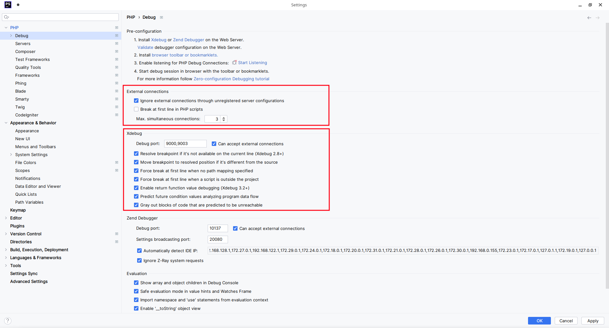
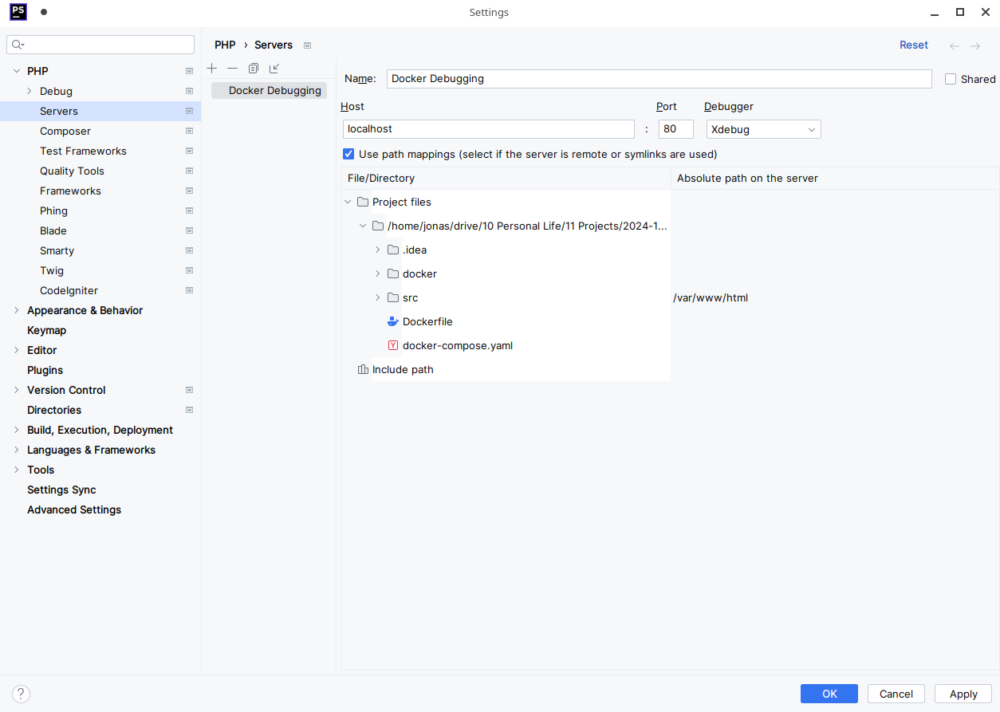
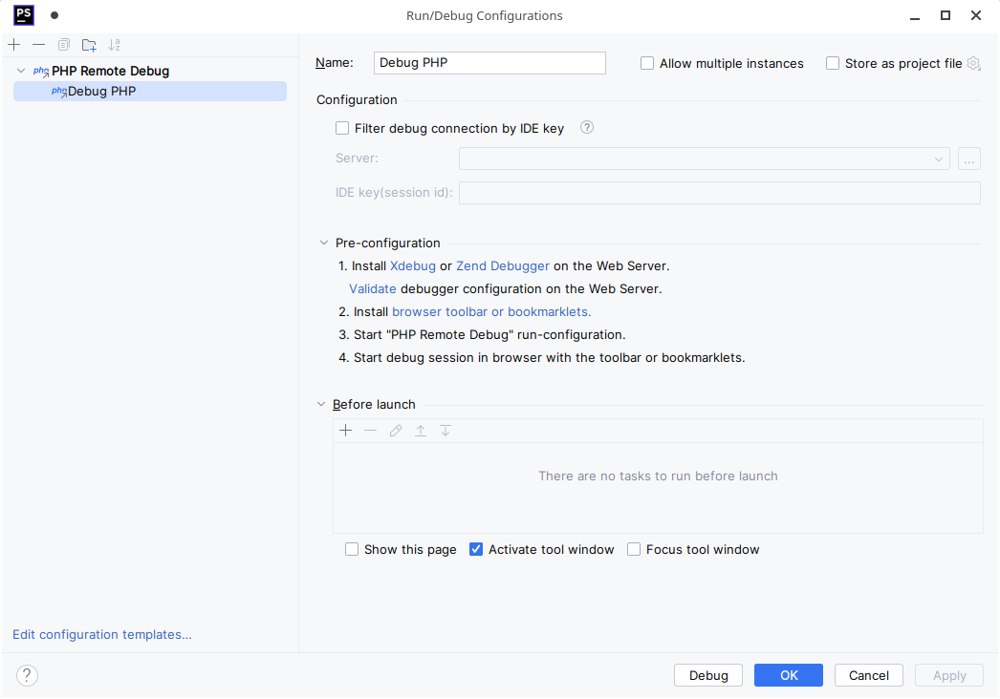
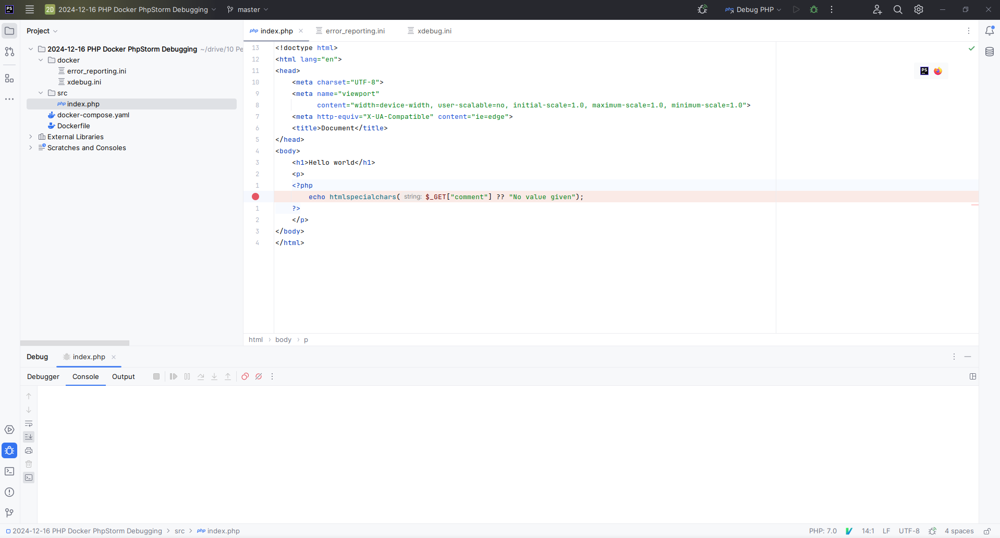
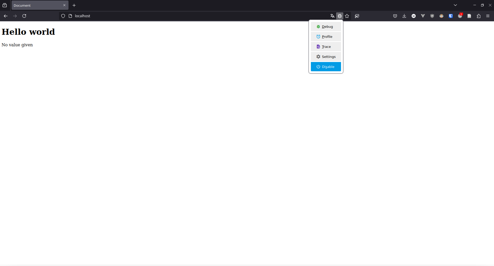
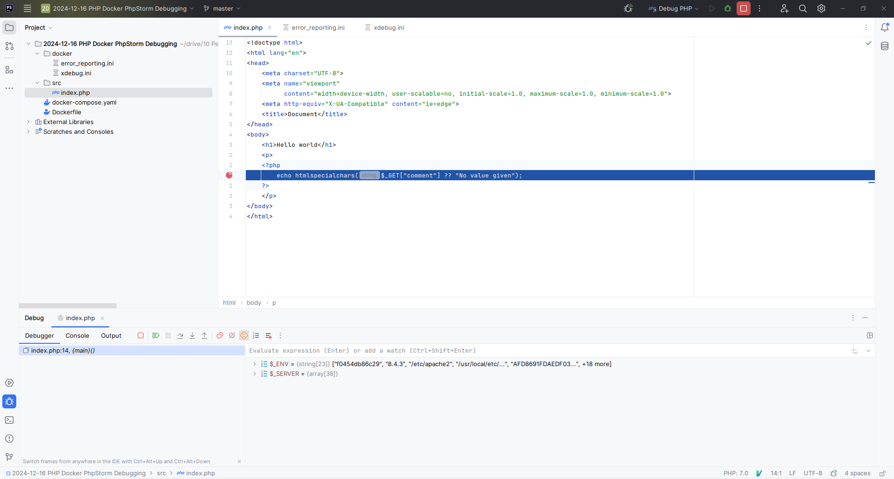

import FigCaption from "../../../components/FigCaption.astro";
import { FileTree } from "@astrojs/starlight/components";
import { Steps } from '@astrojs/starlight/components';

Getting debugging to work with PHP running inside a Docker container can be a hassle. This post is a step-by-step guide
on setting up debugging PHP in a Docker container with PHPStorm. This guide works for any PHP framework and library, no
matter if your project is running vanilla PHP, CodeIgniter or another setup.
You can find a working example project [here [1]](https://github.com/jonasheschl/php-docker-phpstorm-debugging-example).

---

To debug your PHP project with PhpStorm, follow these steps:

<Steps>
1. Create a directory `docker` with the files `error_reporting.ini` and `xdebug.ini`.

   <FileTree>
    - docker
      - error_reporting.ini
      - xdebug.ini
    - src
      - [...]
    - Dockerfile
    - docker-compose.yaml
    - [...]
   </FileTree>

   ```ini title="error_reporting.ini"
   error_reporting=E_ALL
   ```

   ```ini title="xdebug.ini"
   zend_extension=xdebug

   [xdebug]
   xdebug.mode=develop,debug
   xdebug.client_host=host.docker.internal
   xdebug.start_with_request=yes
   ```

2. Mount the two config files you just created into the Docker container by modifying your `docker-compose.yaml` file.

   Your compose file might look different of course. The important thing is to add the three lines indicated just below.

   ```yaml title="docker-compose.yaml" ins={6-8}
   services:
       apache:
           build: .
           ports:
               - "80:80"
           volumes:
               - ./docker/xdebug.ini:/usr/local/etc/php/conf.d/docker-php-ext-xdebug.ini
               - ./docker/error_reporting.ini:/usr/local/etc/php/conf.d/error_reporting.ini
   ```

3. Make your host IP address available inside the container via `host.docker.internal` by further modifying your
  `docker-compose.yaml` file.

    ```yaml title="docker-compose.yaml" ins={9-10}
    services:
        apache:
            build: .
            ports:
                - "80:80"
            volumes:
                - ./docker/xdebug.ini:/usr/local/etc/php/conf.d/docker-php-ext-xdebug.ini
                - ./docker/error_reporting.ini:/usr/local/etc/php/conf.d/error_reporting.ini
            extra_hosts:
                host.docker.internal: host-gateway
    ```

4. Install and enable xdebug in the Docker container by adding the following `RUN` instruction to your `Dockerfile`.

    Your Dockerfile may look different of course. The important thing is just to add
    `RUN pecl install xdebug && docker-php-ext-enable xdebug`.

    ```js title="Dockerfile" ins={3-4}
    FROM php:apache

    RUN pecl install xdebug \
        && docker-php-ext-enable xdebug

    WORKDIR /var/www/html

    COPY src .

    CMD ["apache2-foreground"]
    ```

5. Make sure PhpStorm debug settings are configured correctly.

    These settings should be correctly configured by default. Just to be sure, check them anyway. You can find them
    under File → Settings → PHP → Debug. Make especially sure that the Xdebug ports are not changed from 9000 and 9003.

    

    <FigCaption caption="The Xdebug ports should be set to 9000 and 9003 by default."/>

6. Configure path mappings between PhpStorm and the Docker container.

    Here you have to set the path of you source files as they will be inside the Docker container. The
    exact configuration will depend on your setup. The below screenshot shows how the path mapping will have to be
    configured for the [example project](https://github.com/jonasheschl/php-docker-phpstorm-debugging-example).

    

    <FigCaption caption="The src directory will be mapped to /var/www/html in the Docker container."/>

7. Create a PhpStorm PHP Remote Debug configuration.

    Now create a run configuration for debugging PHP. Add a new configuration and choose "PHP Remote Debug" as the
    type. You won't have to change any settings for the run configuration.

    

    <FigCaption caption="The PHP Remote Debug run configuration. No configuration is neccessary."/>

8. Run the PhpStorm PHP Remote Debug configuration, set a breakpoint and make sure PhpStorm is listening for incoming connection.

    Select the run configuration you just created in the drop-down on the top left. Then press debug (the green bug
    icon).

    

    <FigCaption caption="PhpStorm will break on the selected line."/>

9. Install an Xdebug browser addon, configure the IDE key and enable debugging in the browser.

   For Xdebug to activate, you have to send a special cookie with your requests. There are many browser extensions
   automating this process. Refer to [this table by JetBrains](https://www.jetbrains.com/help/phpstorm/browser-debugging-extensions.html).
   The following screenshot was created using Firefox and [Xdebug helper](https://addons.mozilla.org/de/firefox/addon/xdebug-helper-for-firefox/).

   

   <FigCaption caption="With the browser extension enabled, Xdebug will activate."/>

10. Start the PHP Docker Server.

    Now that everything is set up, you can start your PHP server running in the Docker container. If you use docker
    compose, simply run `docker compose up --build --force-recreate`. The two additional flags make sure changes are
    applied.

11. Set a breakpoint and enjoy your debugging experience!

    Finally, set a breakpoint in PhpStorm and load the corresponding page using your configured browser!

    

    <FigCaption caption="PhpStorm will now break whenever the lines you set a breakpoint on are executed."/>

</Steps>

## References

1. [Repository containing a working PHP, Docker, PHPStorm debugging setup](https://github.com/jonasheschl/php-docker-phpstorm-debugging-example)
2. [Guide by thecodingmachine this post is partially based on](https://thecodingmachine.io/configuring-xdebug-phpstorm-docker)
3. [Buide by Ekino France this post is partially based on](https://medium.com/ekino-france/xdebug-configuration-phpstorm-docker-desktop-817da3005556.)
4. [Docker forum thread this post is partially based on](https://forums.docker.com/t/ip-address-for-xdebug/10460/36)
