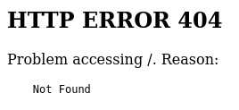
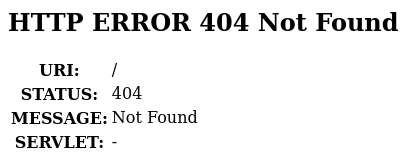

import { Tabs, TabItem, Aside } from '@astrojs/starlight/components';

`helma` is a Java/JavaScript web framework, originally from the late 90s. The framework itself is mostly written in Java,
while application code is written in JavaScript.

---

## Forks of helma

There are currently two forks of `helma`. The unmaintained [classic helma](https://github.com/helma-org/helma)
and the maintained [fork by Antville](https://github.com/antville/helma). Their core differences are that classic
`helma` uses the [Rhino JavaScript engine](https://en.wikipedia.org/wiki/Rhino_(JavaScript_engine)) while Antville
`helma` uses Node.js and Rhino.

An easy way to distinguish between the two from the outside is observing their error messages.

### Spotting classic helma

<Tabs>
  <TabItem label="rendered">
    
  </TabItem>
  <TabItem label="html">
    ```html
    <html>
    <head>
      <meta http-equiv="Content-Type" content="text/html;charset=utf-8"/>
      <title>Error 404 Not Found</title>
    </head>
    <body><h2>HTTP ERROR 404</h2>
    <p>Problem accessing /. Reason:
      <pre>    Not Found</pre></p>
    </body>
    </html>
    ```
  </TabItem>
</Tabs>

### Spotting Antville helma

<Tabs>
  <TabItem label="rendered">
    
  </TabItem>
  <TabItem label="html">
    ```html
    <html>
    <head>
      <meta http-equiv="Content-Type" content="text/html;charset=ISO-8859-1"/>
      <title>Error 404 Not Found</title>
    </head>
    <body><h2>HTTP ERROR 404 Not Found</h2>
    <table>
      <tr><th>URI:</th><td>/</td></tr>
      <tr><th>STATUS:</th><td>404</td></tr>
      <tr><th>MESSAGE:</th><td>Not Found</td></tr>
      <tr><th>SERVLET:</th><td>-</td></tr>
    </table>

    </body>
    </html>
    ```
  </TabItem>
</Tabs>

## Building helma for local debugging

You need to build a jar file of the `helma` server to run it. Read the following sections to learn how. Once you have one,
start `helma` on port 8080 by running the below command.

```shell
java -jar path/to/helma.jar -w 8080
```

You can further configure `helma` using the following switches:

```
Usage: java helma.main.Server [options]
Possible options:
  -a app[,...]      Specify applications to start
  -h dir            Specify hop home directory
  -f file           Specify server.properties file
  -c jetty.xml      Specify Jetty XML configuration file
  -w [ip:]port      Specify embedded web server address/port
  -x [ip:]port      Specify XML-RPC address/port

Supported formats for server ports:
   <port-number>
   <ip-address>:<port-number>
   <hostname>:<port-number>
```

### Building classic helma

<Aside type="caution">Classic helma only works with Java 8!</Aside>

Classic `helma` uses ant as a build tool. You need to have **Java 8** set up. It is best to validate this using
`java --version`. Then simply run `ant jar` in the projects root directory. A `launcher.jar` file will subsequently
be created. This file can be run as described above. The simplest way of running it is using
`java -jar launcher.jar -w 8080`.

### Building Antville helma

<Aside type="caution">Antville helma requires Java 11 or higher, rsync and npx!</Aside>

Antville `helma` uses gradle for building the project. Build Antville `helma` by running `./gradlew build`. This will
create the `launcher.jar` file. You can now run `launcher.jar` as described above. The simplest way of running it is
using `java -jar launcher.jar -w 8080`.

## Structure of a helma app

A `helma` server is structured into apps, which can have actions. Apps are directories in `<project-root>/apps/*`.
Each app can have an `actions.js` file. Every JavaScript function within that file, ending in `_action` will be exposed
to the network. To call an action, send an HTTP request to `/app-name/action-name`. Do not include the `_action`
substring in the `action-name`!

Many functions will return rendered HTML. They usually do this by populating a `.skin` template with (user supplied)
data. `helma` provides a standard function for this pattern.
`renderSkinAsString("skin-template-location", argumentsObject)` will return a string containing the rendered HTML.
Actions can then set the response body to this string. Note that `renderSkinAsString()` does no special char escaping
or input sanitization at all. This can lead to XSS vulnerabilities.

## Common helma misconfigurations

### The `manage-application`

`helma` ships a debugging application, the `manage-application`, by default. You can check its source code
[here](https://github.com/helma-org/helma/tree/master/apps/manage). While it is not enabled by default, many servers
have the debugging applications enabled. When configured correctly, these endpoints will only accept connections from
whitelisted hosts. Many servers don't configure the whitelist correctly, however, allowing access from the public
internet. The `manage-application` exposes many endpoints, but most of them are restricted to authenticated users.
See `checkAuth()` in the
[source code](https://github.com/helma-org/helma/blob/master/apps/manage/Global/functions.js#L107C10-L107C19)
of the `manage-application`.

The following endpoints can be called by unauthenticated users:

+ `/manage/makekey`: Allows you to generate a string that can be used to configure the admin users credentials by
  inserting the string into the application's configuration. This itself is not a security issue. The endpoint is
  vulnerable to a POST XSS, however. blabla, no password, username escape the attribute.
+ `/manage/mrtg`: Allows reading some system statistics.
  - `/manage/mrtg?action=memory`: Returns JVM total memory, JVM free memory, 0 and 0.
  - `/manage/mrtg?action=netstat`: Returns the number of lines in `/proc/net/tcp` - 2, 0, 0 and 0.
  - `/manage/mrtg?action=loadavg`: Returns `/proc/loadavg` over 5 minutes multiplied by 100, 0, 0 and 0.
+ `/manage/image`: Returns a static image of the `helma` logo.

### Monitoring application

Some helma servers have monitoring applications installed. The endpoints can expose useful information
on helma servers.


monitoring applications. especially the
`/monitor/apps` endpoint is very useful. `/monitor/requests` can be used to fingerprint servers and find out if they
are the same or different ones when running behind a reverse proxy and IPs can't be trusted.

+ `/monitor/apps`: Returns a list of `helma` applications running on the server. They can be reached via the names
  returned by the endpoint.
+ `/monitor/memory`: Returns the used and free (JVM?) memory (in bytes?).
+ `/monitor/errors`: Returns the number of error each `helma` application has raised (since the last server restart?).
+ `/monitor/sessions`: Returns the number of active sessions per `helma` application?
+ `/monitor/requests`: Returns the number of requests directed to each `helma` application (since the last server
  restart?). When servers might be behind reverse proxies, this endpoint can be used to fingerprint them.
+ `/monitor/threads`: Returns the number of active threads per `helma` application?

## References

1. [Classic helma GitHub repository](https://github.com/helma-org/helma)
2. [Antville's maintained fork of helma GitHub repository](https://github.com/antville/helma)
3. [helma.org at Internet Archive](http://web.archive.org/web/20180122132315/http://helma.org)
4. [Documentation](http://web.archive.org/web/20100530234322/http://helma.org/documentation/)
5. [API Reference](https://helma.serverjs.org/reference/)
6. [Tutorial](http://web.archive.org/web/20100526182848/http://helma.org/Documentation/Object-Relational+Mapping+Tutorial/)
7. [DocBook](http://dev.orf.at/download/helma/documentation/documentation.pdf)
